# Tiny-PoV

## One Dollar PoV Display with ATtiny13

<p align="center">
   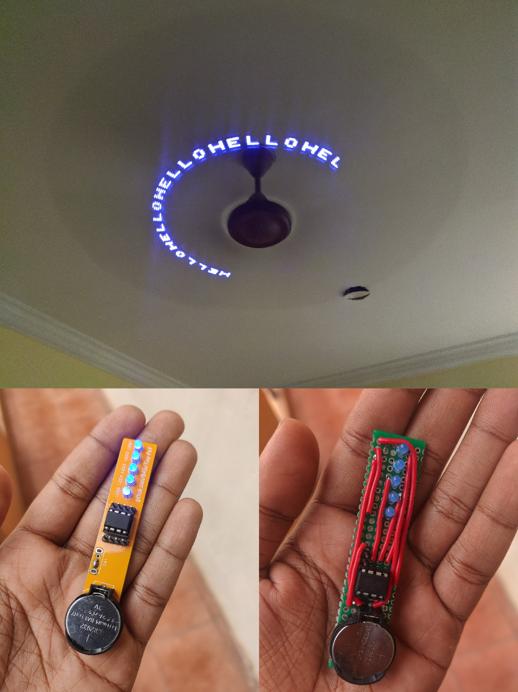
</p>

I was browsing through AliExpress sometime back and this particular listing caught my attention.

5 Pcs of ATtiny13 microcontrollers for ₹124, that's like $1.5.

That's like $0.3 (₹25) per MCU.

Isn't that amazing, a programmable microcontroller! for ₹25.

I googled `"ATtiny13 Arduino"` and yes, ATtiny13 is supported by Arduino. **AWESOME**.

So I immediately placed the order.
AliExpress takes a heck load of time to deliver to India.
I almost forgot that I even placed the order.
After one month or so the package arrived.

ATtiny13 has limited library support, so I was not able to do anything with it, other than blink an LED.

A project that I did a long time ago came to my mind as I thought of what more i could do.
It was a PoV display using ATtiny85.
PoV Displays are basically a bunch of blinking LEDs with some carefully placed delay.
Both ATtiny85 and ATtiny13 have the same pinout.

The total cost of the components for this project is under $1.
If you are in India you can get the ATtiny Microcontroller from this [link](https://www.roboelements.com/product/attiny13-microcontroller-8-bit-atmel-avr-microcontroller/) (Cost 35rs per piece).

### You will be needing these components for this project

-   1 x [ATtiny13](https://www.roboelements.com/product/attiny13-microcontroller-8-bit-atmel-avr-microcontroller/)
-   5 x 3mm LEDs (5mm LED will also work, 3mm looks better as you can put them much closer in PCB)
-   1 x CR2012 Battery
-   1 x CR2012 Battery holder
-   1 x Slide Switch
-   Prototyping PCB or My Custom PCB
-   Soldering Iron

## What are PoV Displays and how do they work?

According to [Wikipedia](https://en.wikipedia.org/wiki/POV), the Persistence of vision is
the optical illusion that occurs when visual perception of an object does not cease for some time after the rays of light proceeding from it have ceased to enter the eye.

If you look at a normal display the pixels are arranged in a matrix fashion.
But in a PoV display Pixels/LEDs are arranged as an array.
How does it display anything you may ask, that's where the Persistence of vision comes into play.
Our eyes won't be seeing different columns of LEDs , they would see what appears to be a proper image.

<p align="center">
   
</p>

### Setting up Arduino IDE for ATtiny13

You might be looking at the ATtiny13 and wondering "How the heck am I supposed to program this thing, it doesn't have any USB port like an Arduino".

Well to program this Microcontroller you need another Arduino, something like `Arduino Nano` or `Arduino Uno`.

Download and install Arduino IDE from this [link](https://www.arduino.cc/en/software).

Connect your Arduino Nano / Uno to the computer using a USB cable.

> Open **Tools -> Boards** and Select your board (Uno / Nano not ATtiny13).

Now we need to convert our Arduino into a programmer (Yeah, we can do that)

In Arduino IDE,

> Open **File -> Examples -> 11.ArduinoISP -> ArduinoISP**

<p align="center">
   
</p>

and click `Upload` Button.

If the upload is successful then you can use your Arduino to program other microcontrollers.

Now we need to install the hardware package for ATtiny13 on Arduino IDE as the IDE doesn't support ATtiny13 by default.

> Open **File -> Preferences -> Additional Boards Manager URLs**

<p align="center">
   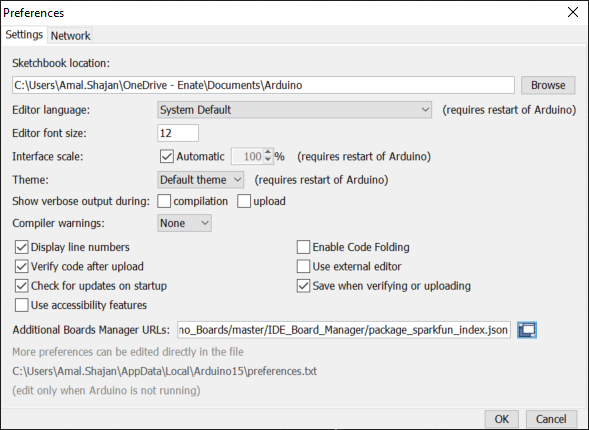
</p>

and paste this

```json
https://mcudude.github.io/MicroCore/package_MCUdude_MicroCore_index.json
```

<p align="center">
   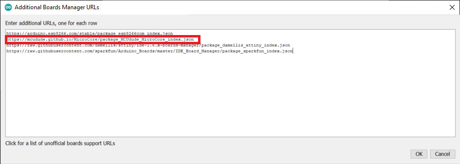
</p>

Then

> Open **Tools -> Board -> Boards manager**.

Find `MicroCore` from the list and click install.

<p align="center">
   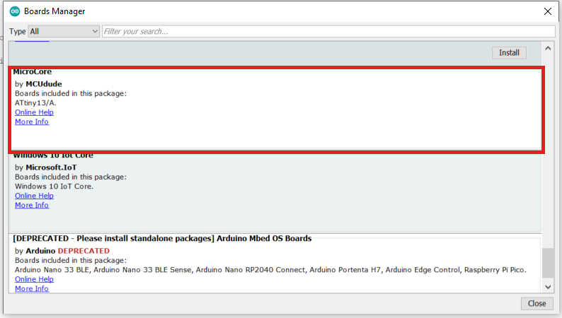
</p>

Now you will be able to select ATtiny13 from arduino IDE

> Select **Tools -> Board -> MicroCore -> ATtiny13**

We need to change few more options in Arduino IDE

> Open **Tools**

and set the following values

| Option     | Value                                                 |
| ---------- | ----------------------------------------------------- |
| Board      | ATtiny13                                              |
| BOD        | 2.7v                                                  |
| Clock      | 9.6Mhz internal Osc.                                  |
| Timing     | "Micors Disabled"                                     |
| Port       | Select Serial Port in which your Arduino is connected |
| Programmer | Arduino as ISP (MicroCore)                            |

<p align="center">
   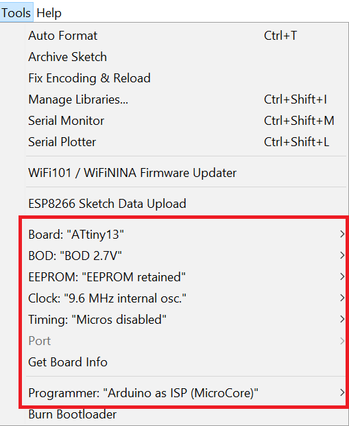
</p>

### Programming the ATtiny13

Now it's time to connect ATtiny to our Arduino.

Connect ATtiny to Arduino as follows
(In ATtiny Pin 1 will be marked using a dot `.`)

<p align="center">
   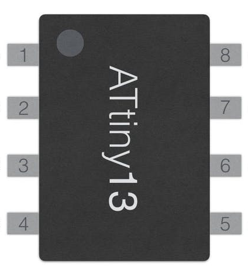
</p>

| ATtiny13 Pin | Arduino Pin  |
| ------------ | ------------ |
| 1            | 10           |
| 5            | 11           |
| 6            | 12           |
| 7            | 13           |
| 8            | 5v           |
| 4            | Ground (GND) |

<p align="center">
   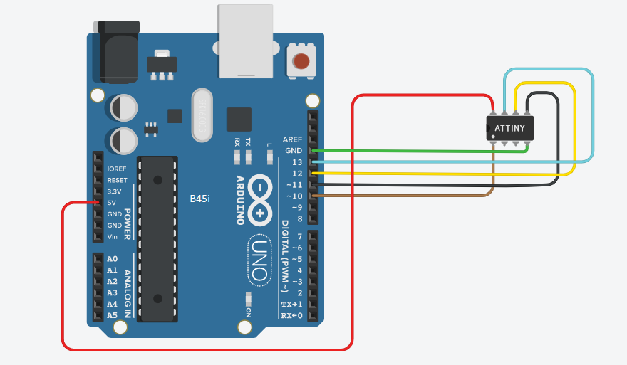
</p>

### Burning Bootloader to ATtiny13

This is a one time setup , you **DON'T** have to repeat it every time you upload code to ATtiny

> Click **Tools -> Burn Bootloader**

<p align="center">
   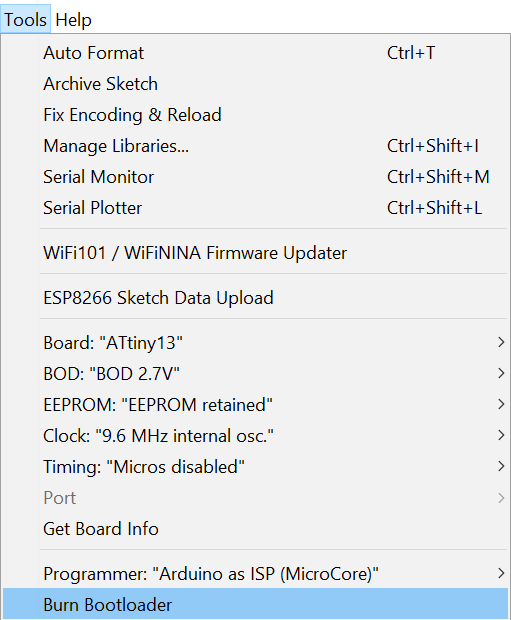
</p>

This will burn the bootloader to the ATtiny, now you can upload programs to ATtiny using Arduino IDE.

### Uploading PoV program to ATtiny

Open a new Sketch in Arduino.

Copy code from this [link](https://github.com/B45i/Tiny-PoV/blob/master/Tiny-POV.ino) and paste it into the newly created sketch.

If you want to change the text change the text on this line:

```cpp
  displayString("HELLO 123 "); // replace with your text
```

Based on the speed of the motor you are going to use, you might want to adjust the code, update variables `DELAY_TIME` and `CHAR_BREAK`

### Building PoV Display Circuit

The PoV display Circuit is fairly simple.
You can wire up the circuit using the following circuit diagram.

<p align="center">
   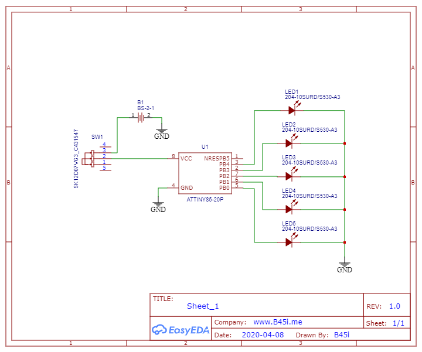
</p>

<p align="center">
   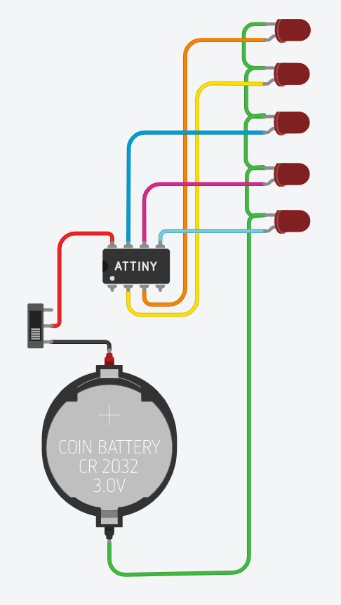
</p>

You can use a Prototyping PCB to solder the circuit.

I've designed a PCB for this circuit.
If you are using the PCB, then you don't have to do any wiring, just solder the components.

You can order the PCBs from [here](http://todo-add-lnk-here) if you’d like to.

or you can download the PCB files form [here](https://github.com/B45i/Tiny-PoV/tree/master/Hardware) and order them from your favourite fab house.

Solder everything,
Add battery,
Turn on the switch and attach it to something that rotates,
like a mini motor or even fan
(Don't forget to adjust the delay in code based on the angular velocity, this might take some trial and error).

And that's it, now you have a PoV display, you will be able to see the letters on a moving object Have fun.

You can add more than just alphabets and numbers, you can even use custom fonts.

I've made two apps for this.
[The first one](https://pov-display-calc.vercel.app/) is written in [Preact](https://preactjs.com/) and it was specifically made for this project, it supports up to 5 LEDs.

<p align="center">
   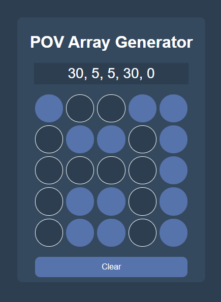
</p>

[The second one](https://po-v-display-calculator.vercel.app/) is written in [Angular](https://angular.io/) and it can support n number of LEDs,

<p align="center">
   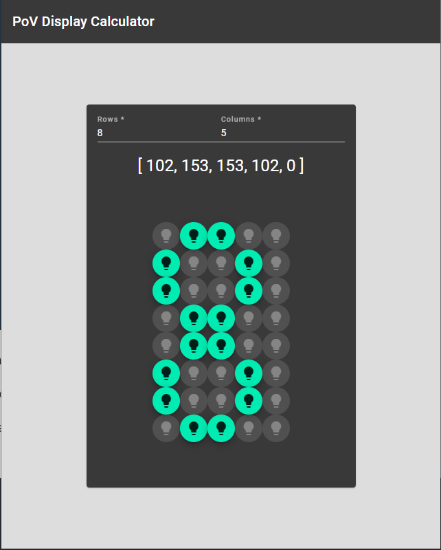
</p>

You can use these apps to generate code for other PoV projects as well

Just generate arrays using these apps and add that code to the array in the sketch.
